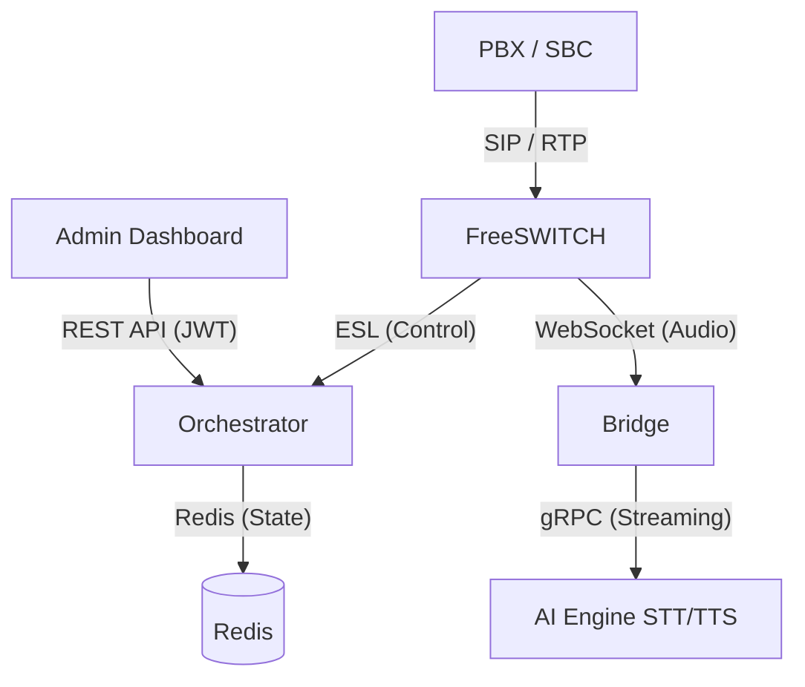

# VoiceBot Gateway (VBGW) — Next-Gen AI Call Center Middleware

[](https://goreportcard.com/report/github.com/nayupuel/vbgw_v2)
[](https://opensource.org/licenses/MIT)
[]()

VBGW는 PBX(SBC)와 AI 엔진(STT/LLM/TTS) 사이의 실시간 음성 스트리밍 및 콜 제어를 중계하는 고성능, 고가용성 게이트웨이입니다. 금융, 보험, 고객센터 등 대규모 트래픽 처리가 필요한 AI 상담 인프라에 최적화되어 있습니다.

---

## 🚀 주요 특징 (Key Features)

### 1. 분산 및 고가용성 (High Availability)
- **Redis 기반 세션 관리**: 멀티 노드 간 통화 상태 동기화 및 Lua Script를 이용한 원자적 용량 제어.
- **장애 자동 복구 (Failover)**: Redis 장애 시 로컬 메모리 스토어로 자동 폴백(Fallback) 하여 서비스 연속성 보장.
- **Failover PBX**: 메인 PBX 장애 시 스탠바이 PBX로 자동 라우팅 지원.

### 2. 현대적인 보안 및 관측성 (Security & Observability)
- **Hardened Auth**: JWT(HMAC-SHA256) 기반의 토큰 인증 및 레거시 API Key 하위 호환 지원.
- **Full Distributed Tracing**: OpenTelemetry(OTLP) 통합으로 HTTP -> Orchestrator -> FreeSWITCH 전 구간 트래픽 추적.
- **Advanced Alerting**: Prometheus AlertManager를 통해 ESL 단절, SIP 등록 해제 등 20여 종의 알림 제공.

### 3. 운용 효율성 (Operational Excellence)
- **OpenAPI 3.0**: 전체 15종의 API 엔드포인트에 대한 완벽한 Swagger 명세 제공.
- **Cloud Native**: Helm Chart를 통한 Kubernetes 즉시 배포 지원.
- **성능 보증**: k6 기반의 SLA 자동 검증 스크립트 및 성능 베이스라인 제공.

---

## 🏗 아키텍처 (Architecture)



---

## 🎬 퀵 스타트 (Quick Start for Beginners)

초보자도 1분 안에 Docker를 통해 테스트 환경을 구축할 수 있습니다.

### Step 1: 사전 요구사항
- **Docker & Docker Compose** 가 설치되어 있어야 합니다. (Mac/Windows/Linux 지원)

### Step 2: 클론 및 실행
```bash
git clone https://github.com/nayupuel/vbgw_v2.git
cd vbgw_v2/vbgw-freeswitch
cp .env.example .env

# 원클릭 실행 (이미지 빌드 포함)
docker-compose up -d
```

### Step 3: 첫 번째 테스트
```bash
# 1. 헬스체크 확인
curl http://localhost:8080/live

# 2. 아웃바운드 콜 생성 테스트 (SIPp 또는 가령의 SIP 폰 준비)
curl -X POST http://localhost:8080/api/v1/calls \
  -H "Authorization: Bearer changeme-admin-key" \
  -H "Content-Type: application/json" \
  -d '{"target_uri": "sip:1004@localhost"}'
```

---

## ⚙️ 상세 설정 및 배포 (Full Guide)

자세한 설정 방법은 아래 개별 문서를 참조하십시오.

- [입문자용 단계별 설치 가이드](vbgw-freeswitch/README.md)
- [환경변수 상세 설정](vbgw-freeswitch/README.md#4-환경변수-설정-상세)
- [Kubernetes 배포 (Helm)](charts/vbgw/README.md)
- [성능 SLA 베이스라인](docs/performance/sla_baseline.md)

---

## 💡 트러블슈팅 (Troubleshooting)

### Case 1: ESL 연결 실패 (Connect Timeout)
- **증상**: 로그에 `ESL connection failed` 메시지가 반복됨.
- **해결**: `.env` 파일의 `ESL_PASSWORD`가 FreeSWITCH 설정 파일(`event_socket.conf.xml`)의 패스워드와 일치하는지 확인하세요.

### Case 2: Redis 장애 시 동작 여부
- **증상**: Redis 컨테이너가 중단되었을 때.
- **동작**: 오케스트레이터가 자동으로 **MemoryFallback** 모드로 전환됩니다. 단, 이 경우 다른 노드와의 세션 공유는 불가능하며 로컬 노드에서만 콜 제어가 이루어집니다.

### Case 3: 소리(Audio)가 전달되지 않음
- **증상**: 콜은 연결되는데 AI 엔진으로 오디오 스트림이 전달되지 않음.
- **해결**:
    1. `vbgw-bridge` 컨테이너가 정상 실행 중인지 확인.
    2. FreeSWITCH에서 `mod_audio_fork` 모듈이 로드되었는지 확인.
    3. 방화벽에서 RTP 포트 범위(기본 16384-16584)가 UDP로 열려있는지 확인.

### Case 4: API 요청 401/403 에러
- **증상**: JWT 또는 API Key 인증 실패.
- **해결**: 
    1. `Authorization` 헤더의 `Bearer` 접두사가 누락되지 않았는지 확인.
    2. `.env`의 `ADMIN_API_KEY` 값과 실제 사용하는 토큰이 일치하는지 확인.

---

## 🛠 기술 스택 (Tech Stack)

- **Language**: Go 1.23+, C++20
- **VoIP**: FreeSWITCH 1.10+, Sofia SIP
- **State**: Redis (Sorted Sets, Lua Scripts)
- **Observability**: OpenTelemetry, Prometheus, Grafana
- **Inference**: ONNX Runtime (Silero VAD)
- **Infra**: Docker, Kubernetes (Helm v3)

---

## 📄 라이선스 (License)
이 프로젝트는 MIT 라이선스를 따릅니다. 상업적 용도로 사용 가능합니다.
